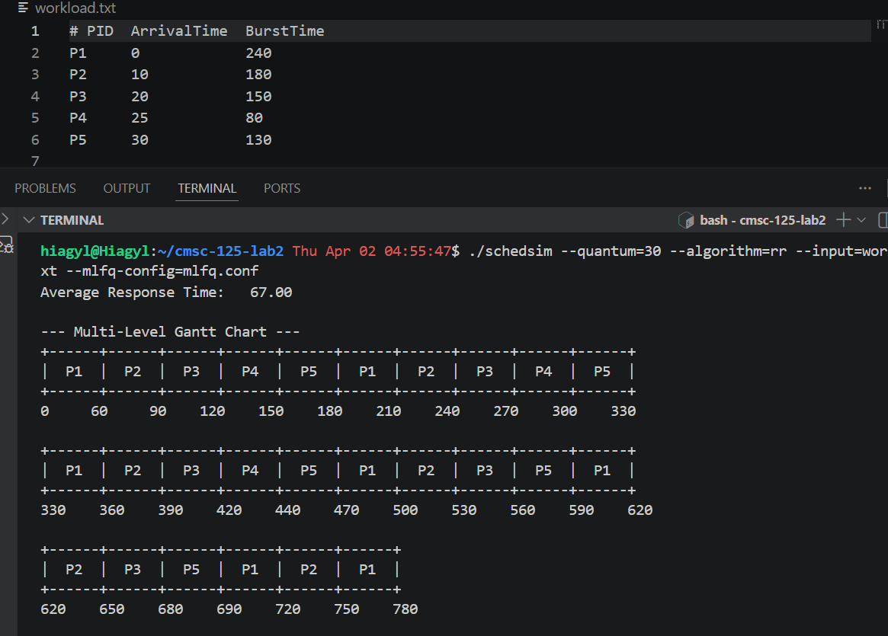
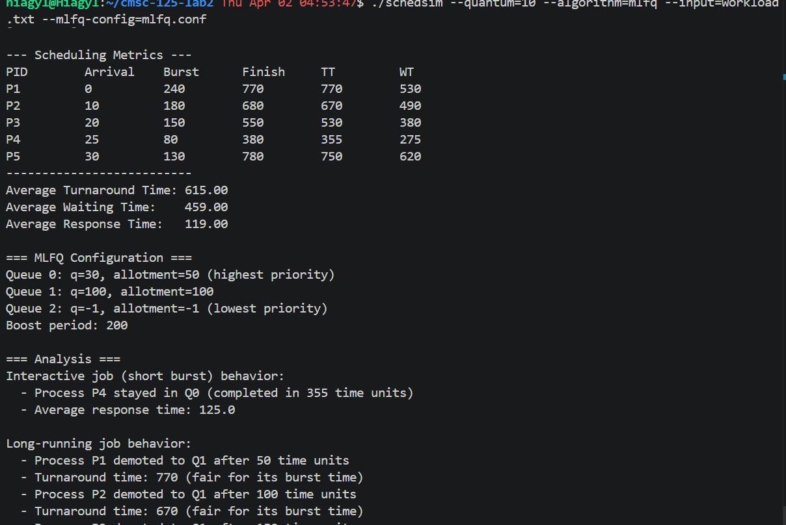
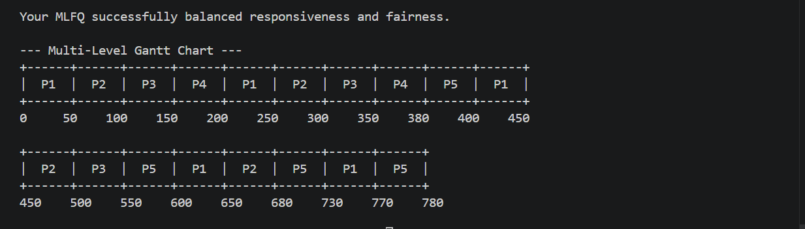
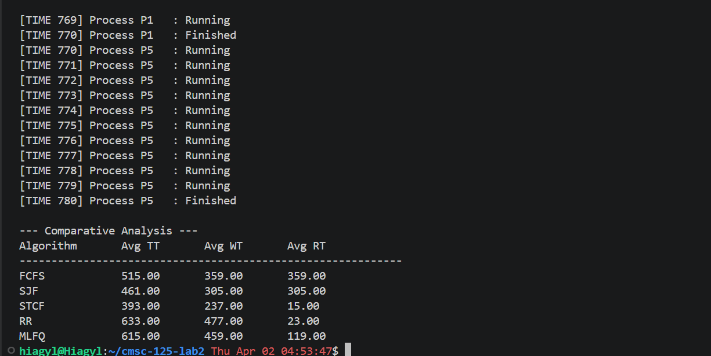

# cmsc-125-lab2 - CPU Scheduling
A discrete-time CPU scheduling simulator implemented in C. It supports multiple scheduling disciplines, dynamic Multi-Level Feedback Queue (MLFQ) configurations, and comprehensive performance metrics.

---

## 1. Compilation and Usage
This project utilizes a **Makefile** to manage object dependencies and ensure clean builds.

### **Build the Simulator**
To compile the source code and generate the schedsim executable:
```bash
make all
```

### **Run a Simulation**
The simulator uses standard CLI flags for configuration:
```bash
./schedsim --algorithm=RR --input=workload1.txt --quantum=10
```

### **Run Automated Tests**
To verify the logic against baseline workloads:
```bash
cd tests && ./test_suite.sh
```

### **Clean Build Files**
```bash
make clean
```

---

## 2. Implemented Features
* **Scheduling Algorithms:**
    * **FCFS**: First-Come, First-Served (non-preemptive).
    * **SJF**: Shortest Job First (non-preemptive).
    * **STCF**: Shortest Time-to-Completion First (preemptive SJF).
    * **RR**: Round Robin with configurable time quantums.
    * **MLFQ**: Multi-Level Feedback Queue with dynamic priority boosting and per-level time allotments.
* **Detailed Event Logging:**
    * Real-time tracking of **Arrivals**, **Execution steps**, and **Preemptions**.
    * Context-switch detection to identify precisely when a process yields the CPU.
* **Performance Metrics:** Calculates Average Wait Time ($T_w$), Turnaround Time ($T_{tr}$), and Response Time ($T_{res}$) for every workload.
* **Robust CLI Parsing:** Uses `getopt_long` to support both short (`-a`) and long (`--algorithm`) flags, with strict `strtol` validation for numeric inputs.
* **Gantt Chart Generation:** Visual representation of process execution over the simulation timeline.

---

## 3. Architecture Overview & Design Decisions
The simulator is built on a **State-Machine architecture** to ensure the simulation clock remains synchronized across all modules.

* **Idempotency & Deep Copies:** To support valid comparative analysis, the system implements a `clone_processes()` utility. This ensures that when running multiple algorithms, each one starts with a pristine copy of the process data, preventing modified "remaining times" from bleeding into subsequent runs.
* **Function Pointer Dispatching:** Uses an `AlgorithmPicker` typedef. This allows the core `run_simulation` engine to remain algorithm-agnostic, simply "asking" the picker which process should run next at each clock tick.
* **Memory Safety:** Employs a **Centralized Cleanup** pattern (`goto cleanup`). This ensures that even on early exits (e.g., file not found), all allocated memory for process arrays and MLFQ configurations is safely freed.
* **POSIX Compliance:** CLI arguments are normalized (case-insensitive) to provide a user experience consistent with standard Linux system utilities.

---

## 4. Known Limitations & Bugs

* **I/O Bound Simulation:** Currently assumes all processes are 100% CPU-bound; there is no simulation for I/O blocking or sleep states.
* **Tie-Breaking:** In cases of identical arrival and burst times, the tie-breaker defaults to the PID's position in the input file rather than a randomized or priority-based selection.
* **Integer Precision:** Metrics are calculated using double-precision floating point, but very large workloads may eventually encounter overflow if total simulation time exceeds `INT_MAX`.

## 5. Screenshots
Sample Results

Result for MLFQ


Comparison
